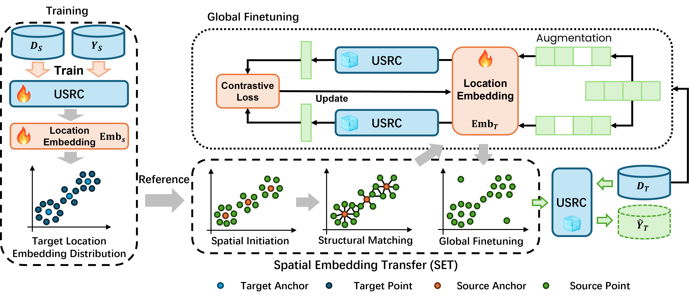

# One Model, Many Cities: A Transferable Social Relationship Inference Framework for Human Mobility Data

This is the offical Codebase for the submitting paper.

Demostration of Spatial Embedding Alignment.

